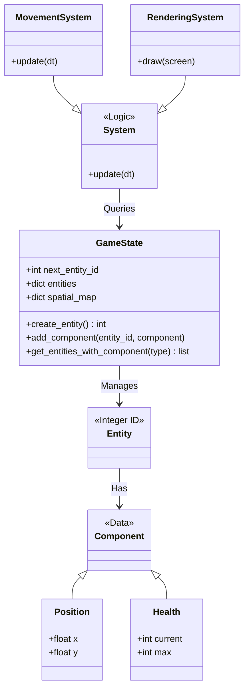

# ECS Architecture

The **Command Line Conflict** engine is built upon the Entity-Component-System (ECS) architectural pattern. This design decouples data from logic, allowing for a flexible and performant game engine.

## Core Concepts

### 1. Entities
In this system, an **Entity** is simply a unique integer ID. It has no behavior or data of its own. It serves as a key to associate various components.

*   **Implementation**: Managed by `GameState.create_entity()`, which returns an incrementing integer.
*   **Storage**: `GameState.entities` is a dictionary mapping `entity_id` to a dictionary of components.

### 2. Components
**Components** are pure data classes. They contain no logic. They define the "aspects" or "properties" of an entity.

*   **Implementation**: Located in `command_line_conflict/components/`.
*   **Examples**:
    *   `Position(x, y)`: Where the entity is.
    *   `Health(hp, max_hp)`: The entity's vitality.
    *   `Movable(velocity)`: The entity's ability to move.
    *   `Renderable(char, color)`: How the entity looks.
    *   `Player(id)`: Who owns the entity.

### 3. Systems
**Systems** contain the logic. They operate on sets of entities that possess specific components. Systems run every frame in the game loop.

*   **Implementation**: Located in `command_line_conflict/systems/`.
*   **Examples**:
    *   `MovementSystem`: Iterates over entities with `Position` and `Movable`. Updates `Position` based on velocity and target.
    *   `RenderingSystem`: Iterates over entities with `Position` and `Renderable`. Draws them to the screen.
    *   `CombatSystem`: Iterates over entities with `Attack` and `Target`. Calculates damage.

## Data Flow

1.  **Game Loop**: The `GameScene.update()` method calls `update()` on each System.
2.  **Query**: Systems ask the `GameState` for entities with specific components using `game_state.get_entities_with_component()`.
3.  **Process**: The system iterates through the entities, reads/writes their component data, and performs logic (e.g., pathfinding, collision checks).
4.  **Events**: Systems can communicate via the `GameState.event_queue` (e.g., `CombatSystem` triggers a 'sound' event, which `SoundSystem` picks up).

## Optimization

*   **Spatial Hashing**: `GameState` maintains a `spatial_map` dictionary for O(1) lookups of entities at a specific (x, y) coordinate. This is critical for collision detection and rendering.
*   **Component Indexing**: `GameState` maintains a `component_index` to allow O(1) retrieval of all entities possessing a specific component type, avoiding full entity list iteration.

## Diagram

