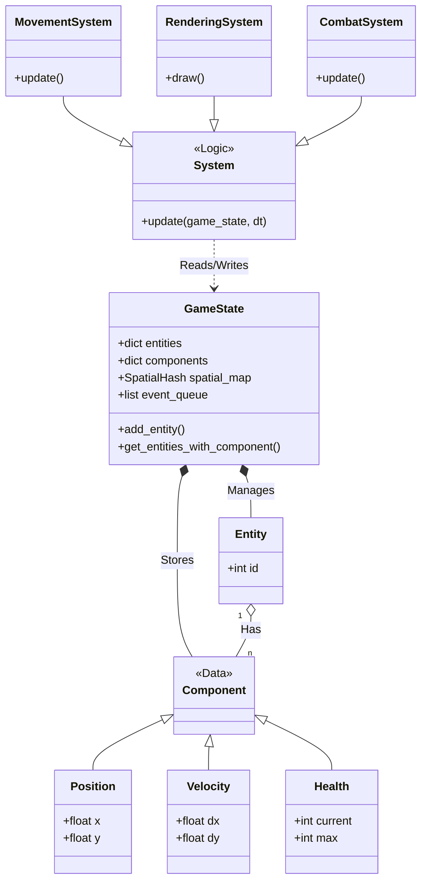

# ECS Architecture

The Entity-Component-System (ECS) is the core architectural pattern used in `command_line_conflict`. It decouples data from behavior, allowing for a flexible and performant game engine.

## Overview Diagram

## Core Concepts

### 1. Entities
An **Entity** is just a unique integer ID. It has no behavior or data of its own. It serves as a key to associate different components together.

### 2. Components
A **Component** is a pure data class. It contains no logic.
*   **Position**: Where an object is.
*   **Renderable**: What an object looks like.
*   **Health**: How much damage an object can take.

### 3. Systems
A **System** contains the logic. It iterates over entities that have a specific set of components and performs operations on them.
*   **MovementSystem**: Iterates over entities with `Position` and `Velocity` and updates `Position` based on `Velocity` * `dt`.
*   **CombatSystem**: Iterates over entities with `Attack` and checks for targets within range.

### 4. GameState
The **GameState** is the central database. It holds:
*   All entities (IDs).
*   All components (mapped by Entity ID).
*   A spatial index (Spatial Hash) for fast position-based lookups.
*   An event queue for inter-system communication (e.g., "Unit Died", "Sound Played").
