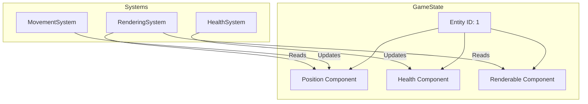

# Entity-Component-System (ECS) Architecture

Command Line Conflict uses an Entity-Component-System (ECS) architecture to manage game objects and logic. This pattern provides flexibility, performance, and a clear separation of concerns.

## Overview

The ECS architecture consists of three main parts:

1.  **Entities**: Unique identifiers (integers) that represent game objects. They are just IDs and hold no data themselves.
2.  **Components**: Pure data containers attached to entities. They define the properties of an entity (e.g., Position, Health, Velocity).
3.  **Systems**: Logic that operates on entities possessing specific components. They implement the game rules (e.g., MovementSystem updates Position based on Velocity).

## Architecture Diagram

## Core Classes

### GameState (`command_line_conflict/game_state.py`)

The `GameState` class acts as the central manager (or "World") for the ECS. It handles:

*   **Entity Creation**: `create_entity()` returns a new unique ID.
*   **Component Management**: `add_component()`, `get_component()`, `remove_component()`.
*   **Entity Queries**: `get_entities_with_component()` allows systems to efficiently iterate over relevant entities.
*   **Spatial Hashing**: Maintains a spatial map for fast position-based lookups.

### Components (`command_line_conflict/components/`)

Components are simple Python classes (often data classes) that store state.

*   `Position(x, y)`: The location of an entity.
*   `Movable(speed, destination)`: Data for movement logic.
*   `Renderable(char, color)`: How the entity appears on screen.
*   `Health(current, max)`: Hit points and vitality.
*   `Player(id)`: Ownership information.

### Systems (`command_line_conflict/systems/`)

Systems implement the behavior. They usually have an `update(dt)` method that is called every frame.

*   `MovementSystem`: Iterates over entities with `Position` and `Movable`. Updates `Position` based on pathfinding and speed.
*   `RenderingSystem`: Iterates over entities with `Position` and `Renderable`. Draws them to the screen.
*   `CombatSystem`: Handles attacks, range checks, and damage application.

## Game Loop

The main game loop in `GameScene` coordinates the ECS:

1.  **Input Handling**: Events are processed and translated into component changes (e.g., setting a `Movable` target).
2.  **Update Phase**: The `update(dt)` method of each system is called sequentially.
    *   `ProductionSystem`
    *   `AISystem`
    *   `MovementSystem`
    *   `CombatSystem`
    *   ...and so on.
3.  **Render Phase**: The `RenderingSystem` draws the current state of the world.

## Adding a New Feature

To add a new feature (e.g., "Mana"):

1.  **Create a Component**: Define `Mana(current, max)` in `components/mana.py`.
2.  **Create a System**: Define `ManaSystem` in `systems/mana_system.py` to handle regeneration or usage.
3.  **Register**: Add the component to entities in `factories.py` and add the system to `GameScene`.
