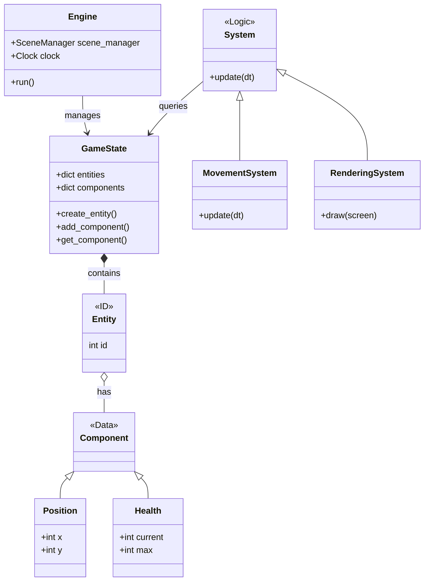

# Entity-Component-System (ECS) Architecture

Command Line Conflict uses an **Entity-Component-System (ECS)** architecture to manage game objects and logic. This pattern favors composition over inheritance, allowing for flexible and performant game development.

## Overview

*   **Entity**: A general purpose object. In this engine, an "Entity" is just a unique integer ID.
*   **Component**: The raw data for one aspect of the object, and how it interacts with the world. A component labels an Entity as possessing this particular aspect.
*   **System**: "System" runs continuously (as though each System had its own private thread) and performs global actions on every Entity that possesses a Component of the same aspect as that System.

## Architecture Diagram

## Core Components

Components are located in `command_line_conflict/components/`. They are pure data classes.

| Component | Description |
| :--- | :--- |
| **Position** | Stores x, y coordinates on the map grid. |
| **Movable** | Stores velocity, target destination, and pathfinding state. |
| **Renderable** | Defines how an entity looks (character, color). |
| **Health** | Manages HP, max HP, and regeneration. |
| **Attack** | Defines damage, range, and attack speed. |
| **Vision** | Defines the vision range for Fog of War. |
| **Player** | Identifies which player (Human, AI, Neutral) owns the entity. |

## Core Systems

Systems are located in `command_line_conflict/systems/`. They contain the business logic.

| System | Description |
| :--- | :--- |
| **MovementSystem** | Updates positions, handles pathfinding (A*), and collision avoidance. |
| **RenderingSystem** | Handles drawing entities, the map, Fog of War, and UI overlays to the screen. |
| **CombatSystem** | Manages target acquisition, attacking, and damage calculation. |
| **AISystem** | Controls AI behavior for non-human players. |
| **UISystem** | Renders the Heads-Up Display (HUD), selection boxes, and tooltips. |
| **SoundSystem** | Listens for game events and plays appropriate sound effects. |

## The Game Loop

1.  **Input**: Pygame events are polled and passed to the active Scene.
2.  **Update**: The active Scene updates `GameState`. Systems iterate over relevant entities and update their components.
3.  **Draw**: The `RenderingSystem` draws the state of the world to the screen.

## Adding a New Feature

To add a new feature (e.g., "Mana"):

1.  **Create a Component**: `components/mana.py` storing `current_mana` and `max_mana`.
2.  **Create a System**: `systems/mana_system.py` handling regeneration or depletion.
3.  **Register**: Add the system to `GameScene` in `command_line_conflict/scenes/game.py`.
4.  **Attach**: Add the `Mana` component to unit factories in `command_line_conflict/factories.py`.
