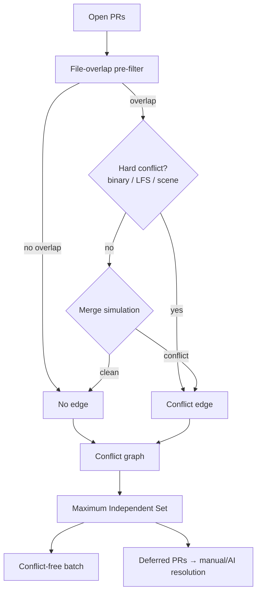

# PR Merge Optimizer

The **PR Merge Optimizer** (`scripts/pr_merge_optimizer`) analyzes a batch of
open pull requests, determines which pairs conflict, and computes the largest
set of pull requests that can be merged together **without any conflicts**. The
pull requests left over are the ones that need manual (or agentic) conflict
resolution.

It is a standalone maintenance tool: it lives under `scripts/` and does not
depend on the game engine.

## Why this is a Maximum Independent Set problem

Model the pull requests as a **conflict graph** `G = (V, E)`:

- **Vertices `V`** are the open pull requests.
- **Edges `E`** connect two pull requests that conflict (a textual merge
  conflict, an unmergeable binary/asset overlap, or a failed merge simulation).

A set of pull requests that can all be merged together is exactly a set of
vertices with **no edges between them** — an *independent set*. The largest such
set is the **Maximum Independent Set (MIS)**, and its size is the maximum number
of pull requests that can be merged simultaneously.

MIS is NP-hard in general, but real conflict graphs are small (tens of pull
requests) and sparse, so the exact branch-and-bound solver in
`pr_merge_optimizer.mis` returns an optimal answer effectively instantly. The
solver applies two standard reductions — always including vertices that have no
remaining neighbours, and branching on the highest-degree vertex — plus an
upper-bound cutoff.

## Pipeline

1. **Fetch** open pull requests and their changed files (from a JSON file or the
   GitHub REST API).
2. **File-overlap pre-filter.** Pull requests that touch no common files cannot
   textually conflict, so they never get an edge.
3. **Precise check** for overlapping pull requests, either via a real
   `git merge-tree` simulation or a conservative default.
4. **Solve the MIS** to get the conflict-free batch; everything else is deferred.



## Command line usage

Run as a module from the repository root:

```bash
python -m scripts.pr_merge_optimizer --input plan.json
```

### JSON input

```json
{
  "prs": [
    {"number": 1, "title": "Add minimap", "branch": "minimap", "files": ["ui.py"]},
    {"number": 2, "title": "Refactor HUD", "branch": "hud", "files": ["ui.py"]},
    {"number": 3, "title": "New map", "files": ["maps/desert.py"]}
  ],
  "conflicts": [[1, 2]]
}
```

- `prs` is required. Each entry needs a `number` and a list of `files`; `title`,
  `branch`, and `base_ref` are optional.
- `conflicts` is optional. When present, those explicit edges are used directly
  and file-based detection is skipped. When absent, the conflict graph is derived
  from file overlap (and, if requested, git simulation).

### Useful flags

| Flag | Effect |
| ---- | ------ |
| `--repo owner/name` | Fetch open pull requests live from GitHub (uses `GITHUB_TOKEN` if set). |
| `--base BRANCH` | Only consider pull requests targeting `BRANCH`. |
| `--simulate-git REPO_DIR` | Run real `git merge-tree` simulations for overlapping pull requests in `REPO_DIR`. |
| `--gitattributes PATH` | Load Git LFS patterns so overlaps on LFS files count as hard conflicts. |
| `--no-engine-hard-conflict` | Do not auto-fail on engine scene/prefab overlaps (use when a smart merge driver is configured). |
| `--allow-unverified-overlaps` | Treat plain overlaps as mergeable when no git simulation is available. |
| `--format {text,json}` | Report format (default `text`). |
| `--output PATH` | Write the report to a file instead of stdout. |

### Example

```text
$ python -m scripts.pr_merge_optimizer --input plan.json
Pull requests analyzed : 3
Conflict-free batch    : 2 (#1, #3)
Deferred for AI resolve: 1 (#2)
Conflict edges         : 1
```

## Adaptations for game / RTS workspaces

Because this repository is a game, some files cannot be textually merged. The
optimizer treats an overlap on any of the following as a **hard conflict** that
is never batched:

- **Binary assets** — images, meshes, audio, fonts, archives (`.png`, `.fbx`,
  `.wav`, …). Two pull requests editing the same asset always conflict.
- **Git LFS tracked files** — supply the repository's `.gitattributes` via
  `--gitattributes` so LFS paths are classified correctly.
- **Engine scene / prefab formats** — Unity `.unity`/`.prefab`, Godot
  `.tscn`/`.tres`, Unreal `.uasset`/`.umap`, etc. The default git driver corrupts
  these, so overlaps are hard conflicts unless a specialised merge driver is
  configured (then pass `--no-engine-hard-conflict`).

For semantic conflicts (code that merges cleanly but breaks the build), provide a
`--simulate-git` directory and extend the merge simulation with a compile/test
step in your own automation.

## Programmatic API

```python
from scripts.pr_merge_optimizer import PRMergeOptimizer, PullRequest

prs = [
    PullRequest(number=1, files={"ui.py"}),
    PullRequest(number=2, files={"ui.py"}),
    PullRequest(number=3, files={"maps/desert.py"}),
]

plan = PRMergeOptimizer().plan(prs)
print(plan.batch)     # e.g. [1, 3]
print(plan.deferred)  # e.g. [2]
```
